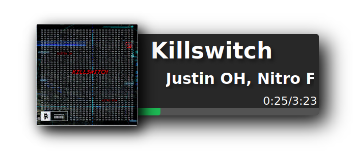
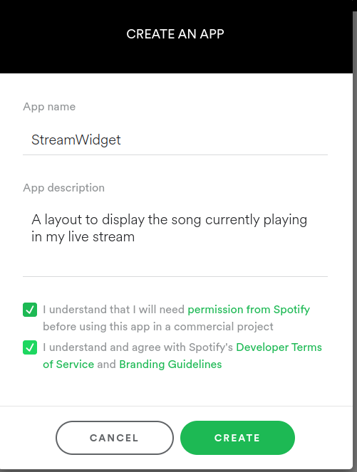
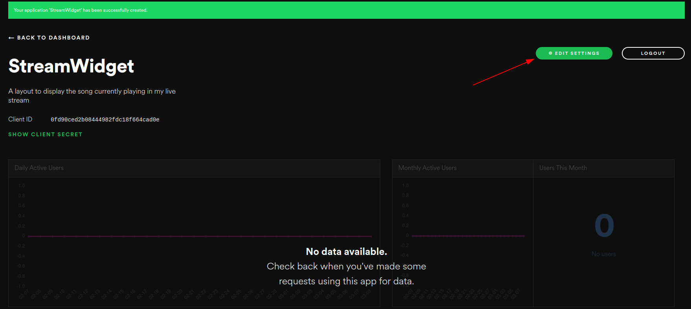
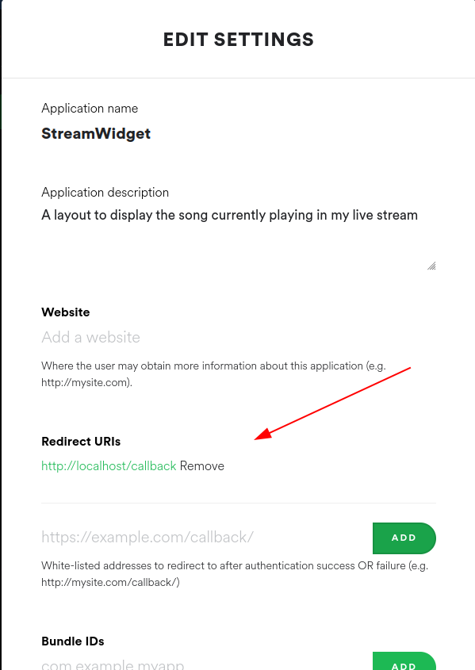
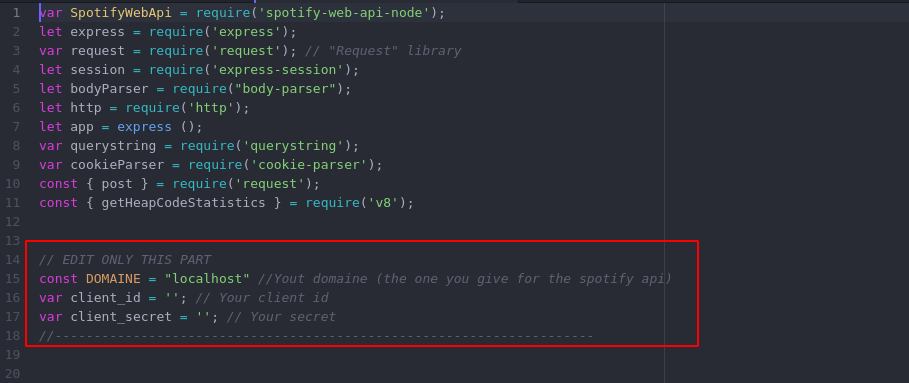
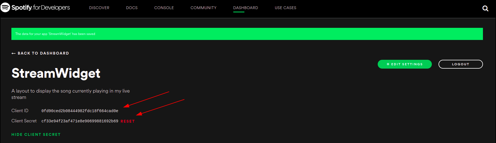
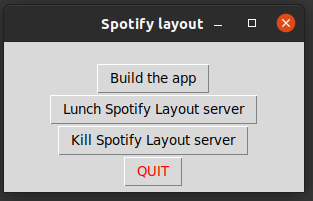

# Spotify-Layout-Stream
A layout to display the song currently playing in my live stream

> Note : The code is open source, so if you have some knowledges about web front-end feel free to edit my css to create your own version. I'm a developer, not a designer :sad: (the code is in views/layout.ejs)


The gif quality is horrible so there is a screen of the final result

# Config

## Requirement

First of all, you need to install [NodeJS](https://nodejs.org/en/) and download this repo (you can clone it or download a zip file).

## SETUP

To use this projet, you'll need a Spotify API key. To get one you need to create a 'app' in Spotify dev.

To create this key, follow those steps:

* Open this [link](https://developer.spotify.com/dashboard/login).

* Login with your spotify account (the login should redirect you to this [page](https://developer.spotify.com/dashboard/applications) automaticaly, if not open the link).

* Click on "create a app" and fill the form.



* Click on "Edit Settings".


* Go to section "Redirect URIs" and add this address : `http://localhost/callback`

> Don't forget to save !!

| Keep the web page open, you'll need it later. |
|---|

* Edit the file main.js add the root of this project.

* In the head of this file, you need to copy keys you find on the web page
 
 
 
 | Don't copy the screenshot's keys, this app doesn't exist anymore |
|---|

 > If you're running this program directly on your computer, you don't need to change the DOMAINE

The setup finish here, now you need to run it

## Lunch the app

There is two ways for running this app.

### Using the interface [Easy way]


> **For this part you need [python3](https://www.python.org/downloads/).**

In the folder you downloaded, there is a file `SpotifyLayout-Manager.py`. You can noramaly run it by double click it if you well installed python. You should get this window

 

 First time you're running the app, you need to click on "Build the app". This should install all the dependencies for NodeJS.

 When it's done, you can click on "Lunch Spotify Layout Server" and scroll to the next chapter.


### Using CLI

Open the project folder in a terminal and run those commands :
```bash
npm install
node main.js
```

> the first command is only needed the first time you're lunching the app


## Enjoy

Now that the app is up and running, you can open it in a browser. The default address is `http://localhost`

You can connect with yout spotify account and enjoy the app !


Made with ❤️ by aatchouuuum

For any problem, join my discord server and ask me [EN/FR] : https://discord.gg/NGJedSHHbF
